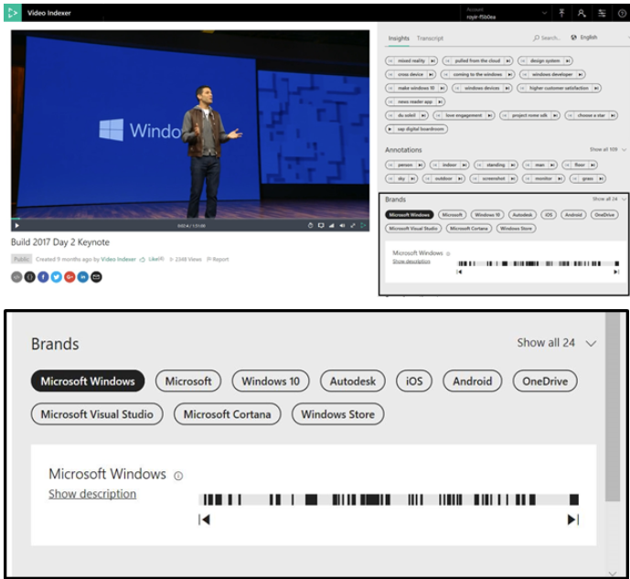

# Customize a Brands model in Azure AI Video Indexer

[!INCLUDE [AMS VI retirement announcement](./includes/important-ams-retirement-avi-announcement.md)]

Azure AI Video Indexer supports brand detection from speech and visual text during indexing and reindexing of video and audio content. The brand detection feature identifies the mention of products, services, and companies suggested by Bing's brands database. For example, if Microsoft is mentioned in a video or audio content or if it shows up in visual text in a video, Azure AI Video Indexer detects it as a brand in the content. Brands are disambiguated from other terms using context.

Brand detection is useful in a wide variety of business scenarios such as content archive and discovery, contextual advertising, social media analysis, retail compete analysis, and more. Azure AI Video Indexer brand detection enables you to index brand mentions in speech and visual text, using Bing's brands database as well as with customization by building a custom Brands model for each Azure AI Video Indexer account. The custom Brands model feature allows you to select whether or not Azure AI Video Indexer will detect brands from the Bing brands database, exclude certain brands from being detected (essentially creating a list of unapproved brands), and include brands that should be part of your model that might not be in Bing's brands database (essentially creating a list of approved brands). The custom Brands model that you create will only be available in the account in which you created the model.

Azure AI Video Indexer supports brand detection from speech and visual text during indexing and reindexing of video and audio content. The brand detection feature identifies mentions of products, services, and companies suggested by Bing's brands database. For example, if Microsoft is mentioned in video or audio content or if it shows up in visual text in a video, Azure AI Video Indexer detects it as a brand in the content. A custom Brands model allows you to exclude certain brands from being detected and include brands that should be part of your model that might not be in Bing's brands database.

> [!NOTE]
> If your video was indexed prior to adding a brand, you need to reindex it.

You can use the Azure AI Video Indexer APIs to create, use, and edit custom Brands models detected in a video, as described in this topic.

Azure AI Video Indexer supports brand detection from speech and visual text during indexing and reindexing of video and audio content. The brand detection feature identifies mentions of products, services, and companies suggested by Bing's brands database. For example, if Microsoft is mentioned in video or audio content or if it shows up in visual text in a video, Azure AI Video Indexer detects it as a brand in the content.

A custom Brands model allows you to:

- select if you want Azure AI Video Indexer to detect brands from the Bing brands database.
- select if you want Azure AI Video Indexer to exclude certain brands from being detected (essentially creating a blocklist of brands).
- select if you want Azure AI Video Indexer to include brands that should be part of your model that might not be in Bing's brands database (essentially creating an accept list of brands).

You can use the Azure AI Video Indexer website to create, use, and edit custom Brands models detected in a video, as described in this article.

> [!NOTE]
> If your video was indexed prior to adding a brand, you need to reindex it. You will find **Re-index** item in the drop-down menu associated with the video. Select **Advanced options** -> **Brand categories** and check **All brands**.

## Out of the box detection example

In the "Microsoft Build 2017 Day 2" presentation, the brand "Microsoft Windows" appears multiple times. Sometimes in the transcript, sometimes as visual text and never as verbatim. Azure AI Video Indexer detects with high precision that a term is indeed brand based on the context, covering over 90k brands out of the box, and constantly updating. At 02:25, Azure AI Video Indexer detects the brand from speech and then again at 02:40 from visual text, which is part of the Windows logo.



Talking about Windows in the context of construction won't detect the word "Windows" as a brand, and same for Box, Apple, Fox, etc., based on advanced Machine Learning algorithms that know how to disambiguate from context. Brand Detection works for all our supported languages.

## [Web portal](#tab/customizewebportal)

## Edit Brands model settings

You have the option to set whether or not you want brands from the Bing brands database to be detected. To set this option, you need to edit the settings of your Brands model. Follow these steps:

1. Go to the [Azure AI Video Indexer](https://www.videoindexer.ai/) website and sign in.
1. To customize a model in your account, select the **Content model customization** button on the left of the page.

    > [!div class="mx-imgBorder"]
    > :::image type="content" source="./media/content-model-customization/content-model-customization.png" alt-text="Customize content model in Azure AI Video Indexer ":::
1. To edit brands, select the **Brands** tab.

    > [!div class="mx-imgBorder"]
    > :::image type="content" source="./media/customize-brand-model/customize-brand-model.png" alt-text="Screenshot shows the Brands tab of the Content model customization dialog box":::
1. Check the **Show brands suggested by Bing** option if you want Azure AI Video Indexer to detect brands suggested by Bing—leave the option unchecked if you don't.

## Include brands in the model

The **Include brands** section represents custom brands that you want Azure AI Video Indexer to detect, even if they aren't suggested by Bing.  

### Add a brand to include list

1. Select **+ Create new brand**.

    Provide a name (required), category (optional), description (optional), and reference URL (optional).
    The category field is meant to help you tag your brands. This field shows up as the brand's *tags* when using the Azure AI Video Indexer APIs. For example, the brand "Azure" can be tagged or categorized as "Cloud".

    The reference URL field can be any reference website for the brand (like a link to its Wikipedia page).

2. Select **Save** and you'll see that the brand has been added to the **Include brands** list.

### Edit a brand on the include list

1. Select the pencil icon next to the brand that you want to edit.

    You can update the category, description, or reference URL of a brand. You can't change the name of a brand because names of brands are unique. If you need to change the brand name, delete the entire brand (see next section) and create a new brand with the new name.

2. Select the **Update** button to update the brand with the new information.

### Delete a brand on the include list

1. Select the trash icon next to the brand that you want to delete.
2. Select **Delete** and the brand will no longer appear in your *Include brands* list.

## Exclude brands from the model

The **Exclude brands** section represents the brands that you don't want Azure AI Video Indexer to detect.

### Add a brand to exclude list

1. Select **+ Create new brand.**

    Provide a name (required), category (optional).

2. Select **Save** and you'll see that the brand has been added to the *Exclude brands* list.

### Edit a brand on the exclude list

1. Select the pencil icon next to the brand that you want to edit.

    You can only update the category of a brand. You can't change the name of a brand because names of brands are unique. If you need to change the brand name, delete the entire brand (see next section) and create a new brand with the new name.

2. Select the **Update** button to update the brand with the new information.

### Delete a brand on the exclude list

1. Select the trash icon next to the brand that you want to delete.
2. Select **Delete** and the brand will no longer appear in your *Exclude brands* list.

## [API](#tab/customizeapi)

## Create a Brand

The [create a brand](https://api-portal.videoindexer.ai/api-details#api=Operations&operation=Create-Brand) API creates a new custom brand and adds it to the custom Brands model for the specified account.

> [!NOTE]
> Setting `enabled` (in the body) to true puts the brand in the *Include* list for Azure AI Video Indexer to detect. Setting `enabled` to false puts the brand in the *Exclude* list, so Azure AI Video Indexer won't detect it.

Some other parameters that you can set in the body:

* The `referenceUrl` value can be any reference websites for the brand, such as a link to its Wikipedia page.
* The `tags` value is a list of tags for the brand. This tag shows up in the brand's *Category* field in the Azure AI Video Indexer website. For example, the brand "Azure" can be tagged or categorized as "Cloud".

### Response

The response provides information on the brand that you just created following the format of the example below.

```json
{
  "referenceUrl": "https://en.wikipedia.org/wiki/Example",
  "id": 97974,
  "name": "Example",
  "accountId": "SampleAccountId",
  "lastModifierUserName": "SampleUserName",
  "created": "2018-04-25T14:59:52.7433333",
  "lastModified": "2018-04-25T14:59:52.7433333",
  "enabled": true,
  "description": "This is an example",
  "tags": [
    "Tag1",
    "Tag2"
  ]
}
```

## Delete a Brand

The [delete a brand](https://api-portal.videoindexer.ai/api-details#api=Operations&operation=Delete-Brand) API removes a brand from the custom Brands model for the specified account. The account is specified in the `accountId` parameter. Once called successfully, the brand will no longer be in the *Include* or *Exclude* brands lists.

### Response

There's no returned content when the brand is deleted successfully.

## Get a specific Brand

The [get a brand](https://api-portal.videoindexer.ai/api-details#api=Operations&operation=Get-Brand) API lets you search for the details of a brand in the custom Brands model for the specified account using the brand ID.

### Response

The response provides information on the brand that you searched (using brand ID) following the format of the example below.

```json
{
  "referenceUrl": "https://en.wikipedia.org/wiki/Example",
  "id": 128846,
  "name": "Example",
  "accountId": "SampleAccountId",
  "lastModifierUserName": "SampleUserName",
  "created": "2018-01-06T13:51:38.3666667",
  "lastModified": "2018-01-11T13:51:38.3666667",
  "enabled": true,
  "description": "This is an example",
  "tags": [
    "Tag1",
    "Tag2"
  ]
}
```

> [!NOTE]
> `enabled` being set to `true` signifies that the brand is in the *Include* list for Azure AI Video Indexer to detect, and `enabled` being false signifies that the brand is in the *Exclude* list, so Azure AI Video Indexer won't detect it.

## Update a specific brand

The [update a brand](https://api-portal.videoindexer.ai/api-details#api=Operations&operation=Update-Brand) API lets you search for the details of a brand in the custom Brands model for the specified account using the brand ID.

### Response

The response provides the updated information on the brand that you updated following the format of the example below.

```json
{
  "referenceUrl": null,
  "id": 97974,
  "name": "Example",
  "accountId": "SampleAccountId",
  "lastModifierUserName": "SampleUserName",
  "Created": "2018-04-25T14:59:52.7433333",
  "lastModified": "2018-04-25T15:37:50.67",
  "enabled": false,
  "description": "This is an update example",
  "tags": [
    "Tag1",
    "NewTag2"
  ]
}
```

## Get all of the Brands

The [get all brands](https://api-portal.videoindexer.ai/api-details#api=Operations&operation=Get-Brands) API returns all of the brands in the custom Brands model for the specified account regardless of whether the brand is meant to be in the *Include* or *Exclude* brands list.

### Response

The response provides a list of all of the brands in your account and each of their details following the format of the example below.

```json
[
    {
        "ReferenceUrl": null,
        "id": 97974,
        "name": "Example",
        "accountId": "AccountId",
        "lastModifierUserName": "UserName",
        "Created": "2018-04-25T14:59:52.7433333",
        "LastModified": "2018-04-25T14:59:52.7433333",
        "enabled": true,
        "description": "This is an example",
        "tags": ["Tag1", "Tag2"]
    },
    {
        "ReferenceUrl": null,
        "id": 97975,
        "name": "Example2",
        "accountId": "AccountId",
        "lastModifierUserName": "UserName",
        "Created": "2018-04-26T14:59:52.7433333",
        "LastModified": "2018-04-26T14:59:52.7433333",
        "enabled": false,
        "description": "This is another example",
        "tags": ["Tag1", "Tag2"]
    },
]
```

> [!NOTE]
> The brand named *Example* is in the *Include* list for Azure AI Video Indexer to detect, and the brand named *Example2* is in the *Exclude* list, so Azure AI Video Indexer won't detect it.

## Get Brands model settings

The [get brands settings](https://api-portal.videoindexer.ai/api-details#api=Operations&operation=Get-Brands) API returns the Brands model settings in the specified account. The Brands model settings represent whether detection from the Bing brands database is enabled or not. If Bing brands aren't enabled, Azure AI Video Indexer will only detect brands from the custom Brands model of the specified account.

### Response

The response shows whether Bing brands are enabled following the format of the example below.

```json
{
  "state": true,
  "useBuiltIn": true
}
```

> [!NOTE]
> `useBuiltIn` being set to true represents that Bing brands are enabled. If `useBuiltin` is false, Bing brands are disabled. The `state` value can be ignored because it has been deprecated.

## Update Brands model settings

The [update brands](https://api-portal.videoindexer.ai/api-details#api=Operations&operation=Update-Brands-Model-Settings) API updates the Brands model settings in the specified account. The Brands model settings represent whether detection from the Bing brands database is enabled or not. If Bing brands aren't enabled, Azure AI Video Indexer will only detect brands from the custom Brands model of the specified account.

The `useBuiltIn` flag set to true means that Bing brands are enabled. If `useBuiltin` is false, Bing brands are disabled.

### Response

There's no returned content when the Brands model setting is updated successfully.

---