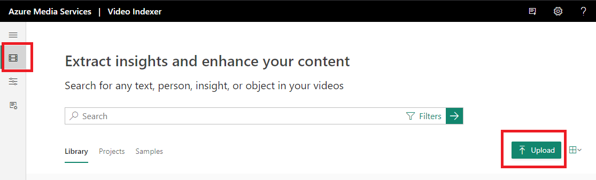
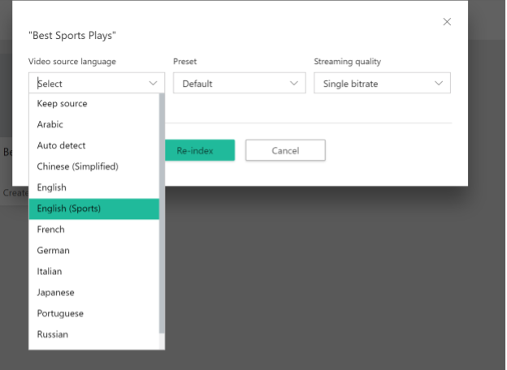
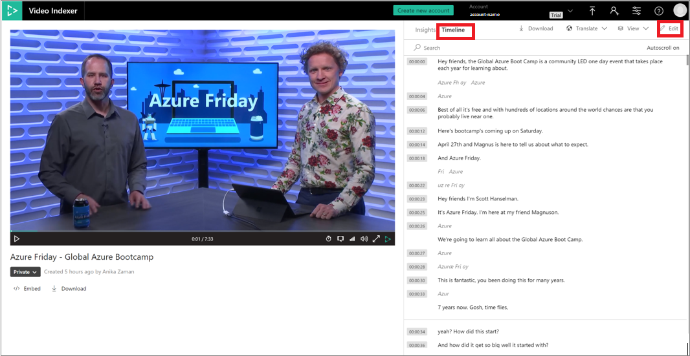
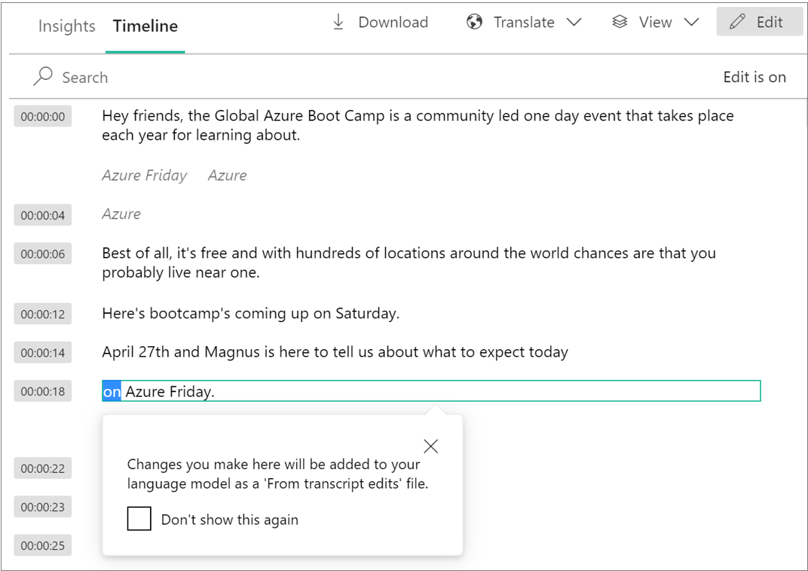
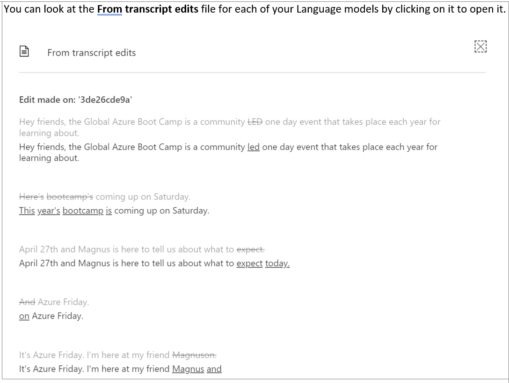

# Customize a Language model with Azure AI Video Indexer

[!INCLUDE [AMS VI retirement announcement](./includes/important-ams-retirement-avi-announcement.md)]

Azure AI Video Indexer supports automatic speech recognition through integration with the Microsoft [Custom Speech Service](https://azure.microsoft.com/services/cognitive-services/custom-speech-service/). You can customize the Language model by uploading adaptation text. This text comes from the domain whose vocabulary you'd like the engine to use to adapt. Once you train your model, new words appearing in the adaptation text is recognized, assuming default pronunciation, and the Language model learns new probable sequences of words. See the list of supported by Azure AI Video Indexer languages in [supported langues](language-support.md). 

For example, *"Kubernetes"* (in the context of Azure Kubernetes service), is a word that is highly specific. Since the word is new to Azure AI Video Indexer, it's recognized as *"communities"*. You need to train the model to recognize it as *"Kubernetes"*. In other cases, the words exist, but the Language model isn't expecting them to appear in a certain context. For example, *"container service"* isn't a 2-word sequence that a nonspecialized Language model would recognize as a specific set of words.

There are two ways to customize a language model:

- **Option 1**: Edit the transcript that was generated by Azure AI Video Indexer. By editing and correcting the transcript, you're training a language model to provide improved results in the future.
- **Option 2**: Upload text file(s) to train the language model. The upload file can either contain a list of words as you would like them to appear in the Video Indexer transcript or the relevant words included naturally in sentences and paragraphs. As better results are achieved with the latter approach, it's recommended for the upload file to contain full sentences or paragraphs related to your content.
 
> [!Important]
> Do not include in the upload file the words or sentences as currently incorrectly transcribed (for example, *"communities"*) as this will negate the intended impact. 
> Only include the words as you would like them to appear (for example, *"Kubernetes"*).

## Best practices for custom Language models

Azure AI Video Indexer learns based on probabilities of word combinations, so to learn best:

* Give enough real examples of sentences as they would be spoken.
* Put only one sentence per line, not more. Otherwise the system will learn probabilities across sentences.
* It's okay to put one word as a sentence to boost the word against others, but the system learns best from full sentences.
* When introducing new words or acronyms, if possible, give as many examples of usage in a full sentence to give as much context as possible to the system.
* Try to put several adaptation options, and see how they work for you.
* Avoid repetition of the exact same sentence multiple times. It may create bias against the rest of the input.
* Avoid including uncommon symbols (~, # @ % &) as they'll get discarded. The sentences in which they appear will also get discarded.
* Avoid putting too large inputs, such as hundreds of thousands of sentences, because doing so will dilute the effect of boosting.

Azure AI Video Indexer lets you create custom Language models to customize speech recognition by uploading adaptation text, namely text from the domain whose vocabulary you'd like the engine to adapt to. Once you train your model, new words appearing in the adaptation text will be recognized.

For a detailed overview and best practices for custom Language models, see [Customize a Language model with Azure AI Video Indexer](customize-language-model-overview.md).

You can use the Azure AI Video Indexer APIs to create and edit custom Language models in your account, as described in this article. You can also use the website, as described in [Customize Language model using the Azure AI Video Indexer website](customize-language-model-with-api.md).

Azure AI Video Indexer lets you create custom Language models to customize speech recognition by uploading adaptation text, namely text from the domain whose vocabulary you'd like the engine to adapt to. Once you train your model, new words appearing in the adaptation text will be recognized.

For a detailed overview and best practices for custom Language models, see [Customize a Language model with Azure AI Video Indexer](customize-language-model-overview.md).

You can use the Azure AI Video Indexer APIs to create and edit custom Language models in your account, as described in this article. You can also use the website, as described in [Customize Language model using the Azure AI Video Indexer website](customize-language-model-with-api.md).

## [Web portal](#tab/customizewebportal)

## Create a Language model

1. Go to the [Azure AI Video Indexer](https://www.videoindexer.ai/) website and sign in.
1. To customize a model in your account, select the **Content model customization** button on the left of the page.

    > [!div class="mx-imgBorder"]
    > :::image type="content" source="./media/customize-language-model/model-customization.png" alt-text="Customize content model in Azure AI Video Indexer ":::
1. Select the **Language** tab.

    You see a list of supported languages.
1. Under the language that you want, select **Add model**.
1. Type in the name for the Language model and hit enter.

    This step creates the model and gives the option to upload text files to the model.
1. To add a text file, select **Add file**. Your file explorer will open.
1. Navigate to and select the text file. You can add multiple text files to a Language model.

    You can also add a text file by selecting the **...** button on the right side of the Language model and selecting **Add file**.
1. Once you're done uploading the text files, select the green **Train** option.

The training process can take a few minutes. Once the training is done, you see **Trained** next to the model. You can preview, download, and delete the file from the model.

> [!div class="mx-imgBorder"]
> :::image type="content" source="./media/customize-language-model/customize-language-model.png" alt-text="Train the model":::

### Using a Language model on a new video

To use your Language model on a new video, do one of the following actions:

* Select the **Upload** button on the top of the page.

    
* Drop your audio or video file or browse for your file.

You're given the option to select the **Video source language**. Select the drop-down and select a Language model that you created from the list. It should say the language of your Language model and the name that you gave it in parentheses. For example:



Select the **Upload** option in the bottom of the page, and your new video will be indexed using your Language model.

### Using a Language model to reindex

To use your Language model to reindex a video in your collection, follow these steps:

1. Sign in to the [Azure AI Video Indexer](https://www.videoindexer.ai/) home page.
1. Click on **...** button on the video and select **Re-index**.
1. You're given the option to select the **Video source language** to reindex your video with. Select the drop-down and select a Language model that you created from the list. It should say the language of your language model and the name that you gave it in parentheses.
1. Select the **Re-index** button and your video will be reindexed using your Language model.

## Edit a Language model

You can edit a Language model by changing its name, adding files to it, and deleting files from it.

If you add or delete files from the Language model, you'll have to train the model again by selecting the green **Train** option.

### Rename the Language model

You can change the name of the Language model by selecting the ellipsis (**...**) button on the right side of the Language model and selecting **Rename**.

Type in the new name and hit enter.

### Add files

To add a text file, select **Add file**. Your file explorer will open.

Navigate to and select the text file. You can add multiple text files to a Language model.

You can also add a text file by selecting the ellipsis (**...**) button on the right side of the Language model and selecting **Add file**.

### Delete files

To delete a file from the Language model, select the ellipsis (**...**) button on the right side of the text file and select **Delete**. A new window pops up telling you that the deletion can't be undone. Select the **Delete** option in the new window.

This action removes the file completely from the Language model.

## Delete a Language model

To delete a Language model from your account, select the ellipsis (**...**) button on the right side of the Language model and select **Delete**.

A new window pops up telling you that the deletion can't be undone. Select the **Delete** option in the new window.

This action removes the Language model completely from your account. Any video that was using the deleted Language model will keep the same index until you reindex the video. If you reindex the video, you can assign a new Language model to the video. Otherwise,  Azure AI Video Indexer will use its default model to reindex the video.

## Customize Language models by correcting transcripts

Azure AI Video Indexer supports automatic customization of Language models based on the actual corrections users make to the transcriptions of their videos.

1. To make corrections to a transcript, open up the video that you want to edit from your Account Videos. Select the **Timeline** tab.

    

1. Select the pencil icon to edit the transcript of your transcription.

    

    Azure AI Video Indexer captures all lines that are corrected by you in the transcription of your video and adds them automatically to a text file called "From transcript edits". These edits are used to retrain the specific Language model that was used to index this video. 
    
    The edits that were done in the [widget's](video-indexer-embed-widgets.md) timeline are also included.
    
    If you didn't specify a Language model when indexing this video, all edits for this video will be stored in a default Language model called "Account adaptations" within the detected language of the video.
    
    In case multiple edits have been made to the same line, only the last version of the corrected line will be used for updating the Language model.  
    
    > [!NOTE]
    > Only textual corrections are used for the customization. Corrections that don't involve actual words (for example, punctuation marks or spaces) aren't included.
    
1. You'll see transcript corrections show up in the Language tab of the Content model customization page.

   To look at the "From transcript edits" file for each of your Language models, select it to open it.

    

## [Web portal](#tab/customizeapi)

## Create a Language model

The [create a language model](https://api-portal.videoindexer.ai/api-details#api=Operations&operation=Create-Language-Model) API creates a new custom Language model in the specified account. You can upload files for the Language model in this call. Alternatively, you can create the Language model here and upload files for the model later by updating the Language model.

> [!NOTE]
> You must still train the model with its enabled files for the model to learn the contents of its files. Directions on training a language are in the next section.

To upload files to be added to the Language model, you must upload files in the body using FormData in addition to providing values for the required parameters above. There are two ways to do this task:

* Key is the file name and value is the txt file.
* Key is the file name and value is a URL to txt file.

### Response

The response provides metadata on the newly created Language model along with metadata on each of the model's files following the format of this example JSON output:

```json
{
    "id": "dfae5745-6f1d-4edd-b224-42e1ab57a891",
    "name": "TestModel",
    "language": "En-US",
    "state": "None",
    "languageModelId": "00000000-0000-0000-0000-000000000000",
    "files": [
    {
        "id": "25be7c0e-b6a6-4f48-b981-497e920a0bc9",
        "name": "hellofile",
        "enable": true,
        "creator": "John Doe",
        "creationTime": "2018-04-28T11:55:34.6733333"
    },
    {
        "id": "33025f5b-2354-485e-a50c-4e6b76345ca7",
        "name": "worldfile",
        "enable": true,
        "creator": "John Doe",
        "creationTime": "2018-04-28T11:55:34.86"
    }
    ]
}

```

## Train a Language model

The [train a language model](https://api-portal.videoindexer.ai/api-details#api=Operations&operation=Train-Language-Model) API trains a custom Language model in the specified account with the contents in the files that were uploaded to and enabled in the language model.

> [!NOTE]
> You must first create the Language model and upload its files. You can upload files when creating the Language model or by updating the Language model.

### Response

The response provides metadata on the newly trained Language model along with metadata on each of the model's files following the format of this example JSON output:

```json
{
    "id": "41464adf-e432-42b1-8e09-f52905d7e29d",
    "name": "TestModel",
    "language": "En-US",
    "state": "Waiting",
    "languageModelId": "531e5745-681d-4e1d-b124-12e5ab57a891",
    "files": [
    {
        "id": "84fcf1ac-1952-48f3-b372-18f768eedf83",
        "name": "RenamedFile",
        "enable": false,
        "creator": "John Doe",
        "creationTime": "2018-04-27T20:10:10.5233333"
    },
    {
        "id": "9ac35b4b-1381-49c4-9fe4-8234bfdd0f50",
        "name": "hellofile",
        "enable": true,
        "creator": "John Doe",
        "creationTime": "2018-04-27T20:10:10.68"
    }
    ]
}
```

The returned `id` is a unique ID used to distinguish between language models, while `languageModelId` is used both for [uploading a video to index](https://api-portal.videoindexer.ai/api-details#api=Operations&operation=Upload-Video) and [reindexing a video](https://api-portal.videoindexer.ai/api-details#api=Operations&operation=Re-Index-Video) APIs (also known as `linguisticModelId` in Azure AI Video Indexer upload/reindex APIs).

## Delete a Language model

The [delete a language model](https://api-portal.videoindexer.ai/api-details#api=Operations&operation=Delete-Language-Model) API deletes a custom Language model from the specified account. Any video that was using the deleted Language model keeps the same index until you reindex the video. If you reindex the video, you can assign a new Language model to the video. Otherwise, Azure AI Video Indexer uses its default model to reindex the video.

### Response

There's no returned content when the Language model is deleted successfully.

## Update a Language model

The [update a Language model](https://api-portal.videoindexer.ai/api-details#api=Operations&operation=Update-Language-Model) API updates a custom Language person model in the specified account.

> [!NOTE]
> You must have already created the Language model. You can use this call to enable or disable all files under the model, update the name of the Language model, and upload files to be added to the language model.

To upload files to be added to the Language model, you must upload files in the body using FormData in addition to providing values for the required parameters above. There are two ways to do this task:

* Key is the file name and value is the txt file.
* Key is the file name and value is a URL to txt file.

### Response

The response provides metadata on the newly trained Language model along with metadata on each of the model's files following the format of this example JSON output:

```json
{
    "id": "41464adf-e432-42b1-8e09-f52905d7e29d",
    "name": "TestModel",
    "language": "En-US",
    "state": "Waiting",
    "languageModelId": "531e5745-681d-4e1d-b124-12e5ab57a891",
    "files": [
    {
        "id": "84fcf1ac-1952-48f3-b372-18f768eedf83",
        "name": "RenamedFile",
        "enable": true,
        "creator": "John Doe",
        "creationTime": "2018-04-27T20:10:10.5233333"
    },
    {
        "id": "9ac35b4b-1381-49c4-9fe4-8234bfdd0f50",
        "name": "hellofile",
        "enable": true,
        "creator": "John Doe",
        "creationTime": "2018-04-27T20:10:10.68"
    }
    ]
}
```

Use the `id` of the files returned in the response to download the contents of the file.

## Update a file from a Language model

The [update a file](https://api-portal.videoindexer.ai/api-details#api=Operations&operation=Update-Language-Model-file) allows you to update the name and `enable` state of a file in a custom Language model in the specified account.

### Response

The response provides metadata on the file that you updated following the format of the example JSON output below.

```json
{
  "id": "84fcf1ac-1952-48f3-b372-18f768eedf83",
  "name": "RenamedFile",
  "enable": false,
  "creator": "John Doe",
  "creationTime": "2018-04-27T20:10:10.5233333"
}
```

Use the `id` of the file returned in the response to download the contents of the file.

## Get a specific Language model

The [get](https://api-portal.videoindexer.ai/api-details#api=Operations&operation=Get-Language-Model) API returns information on the specified Language model in the specified account such as language and the files that are in the Language model.

### Response

The response provides metadata on the specified Language model along with metadata on each of the model's files following the format of this example JSON output:

```json
{
    "id": "dfae5745-6f1d-4edd-b224-42e1ab57a891",
    "name": "TestModel",
    "language": "En-US",
    "state": "None",
    "languageModelId": "00000000-0000-0000-0000-000000000000",
    "files": [
    {
        "id": "25be7c0e-b6a6-4f48-b981-497e920a0bc9",
        "name": "hellofile",
        "enable": true,
        "creator": "John Doe",
        "creationTime": "2018-04-28T11:55:34.6733333"
    },
    {
        "id": "33025f5b-2354-485e-a50c-4e6b76345ca7",
        "name": "worldfile",
        "enable": true,
        "creator": "John Doe",
        "creationTime": "2018-04-28T11:55:34.86"
    }
    ]
}
```

Use the `id` of the file returned in the response to download the contents of the file.

## Get all the Language models

The [get all](https://api-portal.videoindexer.ai/api-details#api=Operations&operation=Get-Language-Models) API returns all of the custom Language models in the specified account in a list.

### Response

The response provides a list of all of the Language models in your account and each of their metadata and files following the format of this example JSON output:

```json
[
    {
        "id": "dfae5745-6f1d-4edd-b224-42e1ab57a891",
        "name": "TestModel",
        "language": "En-US",
        "state": "None",
        "languageModelId": "00000000-0000-0000-0000-000000000000",
        "files": [
        {
            "id": "25be7c0e-b6a6-4f48-b981-497e920a0bc9",
            "name": "hellofile",
            "enable": true,
            "creator": "John Doe",
            "creationTime": "2018-04-28T11:55:34.6733333"
        },
        {
            "id": "33025f5b-2354-485e-a50c-4e6b76345ca7",
            "name": "worldfile",
            "enable": true,
            "creator": "John Doe",
            "creationTime": "2018-04-28T11:55:34.86"
        }
        ]
    },
    {
        "id": "dfae5745-6f1d-4edd-b224-42e1ab57a892",
        "name": "AnotherTestModel",
        "language": "En-US",
        "state": "None",
        "languageModelId": "00000000-0000-0000-0000-000000000001",
        "files": []
    }
]
```

## Delete a file from a Language model

The [delete](https://api-portal.videoindexer.ai/api-details#api=Operations&operation=Delete-Language-Model-File) API deletes the specified file from the specified Language model in the specified account.

### Response

There's no returned content when the file is deleted from the Language model successfully.

## Get metadata on a file from a Language model

The [get metadata of a file](https://api-portal.videoindexer.ai/api-details#api=Operations&operation=Get-Language-Model-File-Data) API returns the contents of and metadata on the specified file from the chosen Language model in your account.

### Response

The response provides the contents and metadata of the file in JSON format, similar to this example:

```json
{
    "content": "hello\r\nworld",
    "id": "84fcf1ac-1952-48f3-b372-18f768eedf83",
    "name": "Hello",
    "enable": true,
    "creator": "John Doe",
    "creationTime": "2018-04-27T20:10:10.5233333"
}
```

> [!NOTE]
> The contents of this example file are the words "hello" and world" in two separate lines.

## Download a file from a Language model

The [download a file](https://api-portal.videoindexer.ai/api-details#api=Operations&operation=Download-Language-Model-File-Content) API downloads a text file containing the contents of the specified file from the specified Language model in the specified account. This text file should match the contents of the text file that was originally uploaded.

### Response

The response is the download of a text file with the contents of the file in the JSON format.

---
