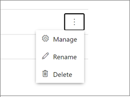
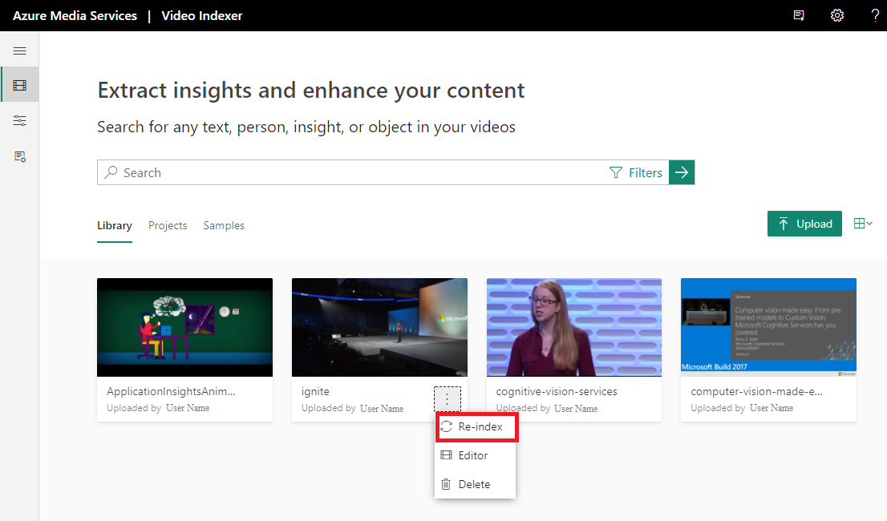
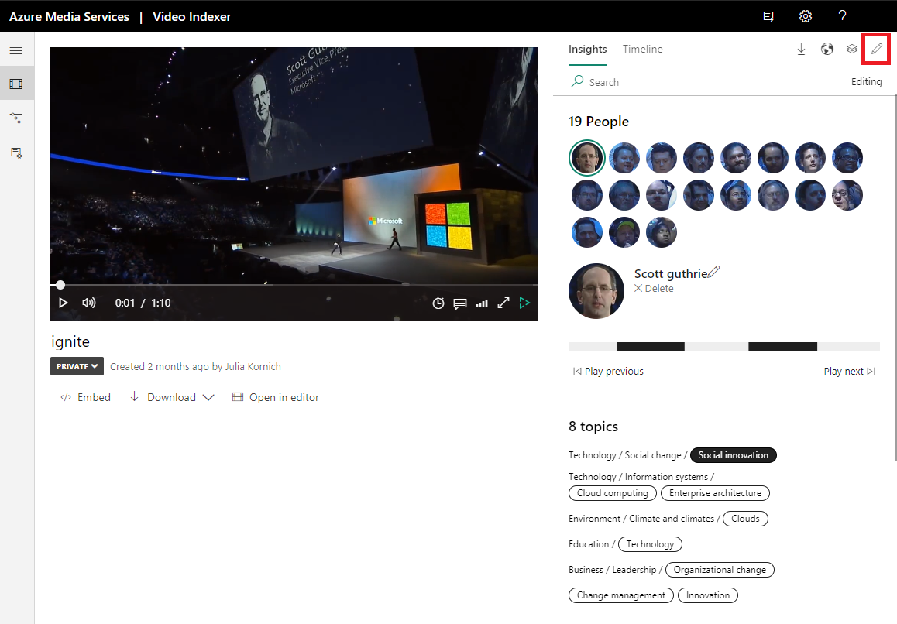

# Customize a Person model in Azure AI Video Indexer 

[!INCLUDE [AMS VI retirement announcement](./includes/important-ams-retirement-avi-announcement.md)]

[!INCLUDE [Gate notice](./includes/face-limited-access.md)]

Azure AI Video Indexer supports celebrity recognition in your videos. The celebrity recognition feature covers approximately one million faces based on commonly requested data sources such as IMDB, Wikipedia, and top LinkedIn influencers. Faces that aren't recognized by Azure AI Video Indexer are still detected, but are left unnamed. You can build custom Person models and enable Azure AI Video Indexer to recognize faces that aren't recognized by default. You can build these Person models by pairing a person's name with image files of the person's face.

You can benefit from creating multiple Person models per account. For example, if the content in your account is meant to be sorted into different channels, you might want to create a separate Person model for each channel. 

> [!NOTE]
> Each Person model supports up to 1 million people and each account has a limit of 50 Person models. 

Once a model is created, you can use it by providing the model ID of a specific Person model when uploading/indexing or re-indexing a video. Training a new face for a video updates the associated custom model. 

> [!TIP]
> If you don't need the multiple Person model support, don't assign a Person model ID to your video when uploading/indexing or re-indexing. In this case, Azure AI Video Indexer will use the default Person model in your account. 

You can use the Azure AI Video Indexer website to edit faces that were detected in a video and to manage multiple custom Person models in your account, as described in the [Customize a Person model using the website](customize-person-model-with-website.md) article. You can also use the API, as described in [Customize a Person model using APIs](customize-person-model-with-api.md).


## [Web portal](#tab/customizewebportal)

[!INCLUDE [Gate notice](./includes/face-limited-access.md)]

Azure AI Video Indexer supports celebrity recognition for video content. The celebrity recognition feature covers approximately one million faces based on commonly requested data source such as IMDB, Wikipedia, and top LinkedIn influencers. For a detailed overview, see [Customize a Person model in Azure AI Video Indexer](customize-person-model-overview.md).

You can use the Azure AI Video Indexer website to edit faces that were detected in a video, as described in this article. You can also use the API, as described in [Customize a Person model using APIs](customize-person-model-with-api.md).

## Central management of Person models in your account

1. To view, edit, and delete the Person models in your account, browse to the Azure AI Video Indexer website and sign in.
1. Select the content model customization button on the left of the page.

    > [!div class="mx-imgBorder"]
    > :::image type="content" source="./media/content-model-customization/content-model-customization.png" alt-text="Customize content model":::
1. Select the People tab.

    You'll see the Default Person model in your account. The Default Person model holds any faces you may have edited or changed in the insights of your videos for which you didn't specify a custom Person model during indexing.

    If you created other Person models, they'll also be listed on this page.

    > [!div class="mx-imgBorder"]
    > :::image type="content" source="./media/customize-face-model/content-model-customization-people-tab.png" alt-text="Customize people":::

## Create a new Person model

1. Select the **+ Add model** button on the right.
1. Enter the name of the model and select the check button to save the new model created. You can now add new people and faces to the new Person model.
1. Select the list menu button and choose **+ Add person**.

    > [!div class="mx-imgBorder"]
    > :::image type="content" source="./media/customize-face-model/add-new-person.png" alt-text="Add a peron":::

## Add a new person to a Person model

> [!NOTE]
> Azure AI Video Indexer allows you to add multiple people with the same name in a Person model. However, it's recommended you give unique names to each person in your model for usability and clarity.

1. To add a new face to a Person model, select the list menu button next to the Person model that you want to add the face to.
1. Select **+ Add person** from the menu.

    A pop-up will prompt you to fill out the Person's details. Type in the name of the person and select the check button.

    You can then choose from your file explorer or drag and drop the face images of the face. Azure AI Video Indexer will take all standard image file types (ex: JPG, PNG, and more).

    Azure AI Video Indexer can detect occurrences of this person in the future videos that you index and the current videos that you had already indexed, using the Person model to which you added this new face. Recognition of the person in your current videos might take some time to take effect, as this is a batch process.

## Rename a Person model

You can rename any Person model in your account including the Default Person model. Even if you rename your default Person model, it will still serve as the Default person model in your account.

1. Select the list menu button next to the Person model that you want to rename.
1. Select **Rename** from the menu.
1. Select the current name of the model and type in your new name.
1. Select the check button for your model to be renamed.

## Delete a Person model

You can delete any Person model that you created in your account. However, you can't delete your Default person model.

1. Select **Delete** from the menu.

    A pop-up will show up and notify you that this action will delete the Person model and all of the people and files that it contains. This action can't be undone.
1. If you're sure, select delete again.

> [!NOTE]
> The existing videos that were indexed using this (now deleted) Person model won't support the ability for you to update the names of the faces that appear in the video. You'll be able to edit the names of faces in these videos only after you reindex them using another Person model. If you reindex without specifying a Person model, the default model will be used.

## Manage existing people in a Person model

To look at the contents of any of your Person models, select the arrow next to the name of the Person model. Then you can view all of the people in that particular Person model. If you select the list menu button next to each of the people, you see manage, rename, and delete options.  



### Rename a person

1. To rename a person in your Person model, select the list menu button and choose **Rename** from the list menu.
1. Select the current name of the person and type in your new name.
1. Select the check button, and the person will be renamed.

### Delete a person

1. To delete a person from your Person model, select the list menu button and choose **Delete** from the list menu.
1. A pop-up tells you that this action will delete the person and that this action can't be undone.
1. Select **Delete** again and this will remove the person from the Person model.

### Check if a person already exists 

You can use the search to check if a person already exists in the model.

### Manage a person

If you select **Manage**, you see the **Person's details** window with all the faces that this Person model is being trained from. These faces come from occurrences of that person in videos that use this Person model or from images that you've manually uploaded.

> [!TIP]
> You can get to the **Person's details** window by clicking on the person's name or by clicking **Manage**, as shown above.

#### Add a face

You can add more faces to the person by selecting **Add images**.

#### Delete a face

Select the image you wish to delete and click **Delete**.

#### Rename and delete a person 

You can use the manage pane to rename the person and to delete the person from the Person model.

## Use a Person model to index a video

You can use a Person model to index your new video by assigning the Person model during the upload of the video.

To use your Person model on a new video, do the following steps:

1. Select the **Upload** button on the right of the page.
1. Drop your video file or browse for your file.
1. Select the **Advanced options** arrow.
1. Select the drop-down and select the Person model that you created.
1. Select the **Upload** option in the bottom of the page, and your new video will be indexed using your Person model.

If you don't specify a Person model during the upload, Azure AI Video Indexer will index the video using the Default Person model in your account.

## Use a Person model to reindex a video

To use a Person model to reindex a video in your collection, go to your account videos on the Azure AI Video Indexer home page, and hover over the name of the video that you want to reindex.

You see options to edit, delete, and reindex your video.

1. Select the option to reindex your video.

    

    You can now select the Person model to reindex your video with.
1. Select the drop-down and select the Person model that you want to use.
1. Select the **Reindex** button and your video will be reindexed using your Person model.

Any new edits that you make to the faces detected and recognized in the video that you just reindexed will be saved in the Person model that you used to reindex the video.

## Managing people in your videos

You can manage the faces that are detected and people that are recognized in the videos that you index by editing and deleting faces.

Deleting a face removes a specific face from the insights of the video.

Editing a face renames a face that's detected and possibly recognized in your video. When you edit a face in your video, that name is saved as a person entry in the Person model that was assigned to the video during upload and indexing.

If you don't assign a Person model to the video during upload, your edit is saved in your account's Default person model.

### Edit a face

> [!NOTE]
> If a Person model has two or more different people with the same name, you won't be able to tag that name within the videos that use that Person model. You'll only be able to make changes to people that share that name in the People tab of the content model customization page in Azure AI Video Indexer. For this reason, it's recommended that you give unique names to each person in your Person model.

1. Browse to the Azure AI Video Indexer website and sign in.
1. Search for a video you want to view and edit in your account.
1. To edit a face in your video, go to the Insights tab and select the pencil icon on the top-right corner of the window.

    

1. Select any of the detected faces and change their names from "Unknown #X" (or the name that was previously assigned to the face).
1. After typing in the new name, select the check icon next to the new name. This action saves the new name and recognizes and names all occurrences of this face in your other current videos and in the future videos that you upload. Recognition of the face in your other current videos might take some time to take effect as this is a batch process.

If you name a face with the name of an existing person in the Person model that the video is using, the detected face images from this video of that person will merge with what already exists in the model. If you name a face with a new name, a new Person entry is created in the Person model that the video is using.

### Delete a face

To delete a detected face in your video, go to the Insights pane and select the pencil icon in the top-right corner of the pane. Select the **Delete** option underneath the name of the face. This action removes the detected face from the video. The person's face will still be detected in the other videos in which it appears, but you can delete the face from those videos as well after they've been indexed.

The person, if they had been named, will also continue to exist in the Person model that was used to index the video from which you deleted the face unless you specifically delete the person from the Person model.

## Optimize the ability of your model to recognize a person

To optimize your model ability to recognize the person, upload as many different images as possible and from different angles. To get optimal results, use high resolution images.

## Get an indication of the quality of your people model

You can get an indication on the quality of your customized People model (poor, fair, good). The quality is determined by the number of images used for labeling with the more images you use to label a person, the higher the probability to identify the person correctly. For example, the probability of identifying a person with 24 labeled images is higher than the probability of identifying a person with 2 labeled images. You can see the number of images used for labeling each person in your customized People model page.

:::image type="content" source="media/common/people-model-quality.jpg" lightbox="media/common/people-model-quality.jpg" alt-text="Screenshot of the video indexer interface showing the quality of people model results":::

## Choose the custom people model as default

You can now choose a customized People model as default on the VI account user level, so you don't have to keep selecting the model name for every video upload. This will save you time and effort when you upload videos that need to be analyzed by your customized People model.

## Group unknown people in the video (Preview)
You can see the unknown people in your videos grouped by their appearance similarity. This will help you label the unknown people more easily and quickly, and to improve the accuracy of your customized People model. This could, for example, help you to label a local celebrity or a local politician. You can see the grouping of unknown people in your customization page.  Choose **people** and then navigate to the **unknown people** tab. 

:::image type="content" source="media/common/grouping-unknown.jpg" lightbox="media/common/grouping-unknown.jpg" alt-text="Screen shot of video indexer interface for grouping people identified in video":::

## Search results with max confidence score for identified person name: 
You can search for the name of an identified person and get the timestamp for when the person appears in the video along with the maximum confidence score. This helps you decide what are the most relevant videos to explore. For example, you can search for “John Smith” and get the videos where John Smith is recognized by your customized People model and the confidence score for each video.

:::image type="content" source="media/common/person-max-confidence.jpg" alt-text="screenshot of the video indexer infterface showing the max confidence of a result":::


## [API](#tab/customizeapi)

Azure AI Video Indexer supports face detection and celebrity recognition for video content. The celebrity recognition feature covers about one million faces based on commonly requested data source such as IMDB, Wikipedia, and top LinkedIn influencers. Faces that aren't recognized by the celebrity recognition feature are detected but left unnamed. After you upload your video to Azure AI Video Indexer and get results back, you can go back and name the faces that weren't recognized. Once you label a face with a name, the face and name get added to your account's Person model. Azure AI Video Indexer will then recognize this face in your future videos and past videos.

You can use the Azure AI Video Indexer API to edit faces that were detected in a video, as described in this topic. You can also use the Azure AI Video Indexer website, as described in [Customize Person model using the Azure AI Video Indexer website](customize-person-model-with-api.md).

## Managing multiple Person models

Azure AI Video Indexer supports multiple Person models per account. This feature is currently available only through the Azure AI Video Indexer APIs.

If your account caters to different use-case scenarios, you might want to create multiple Person models per account. For example, if your content is related to sports, you can then create a separate Person model for each sport (football, basketball, soccer, and so on).

Once a model is created, you can use it by providing the model ID of a specific Person model when uploading/indexing or reindexing a video. Training a new face for a video updates the specific custom model that the video was associated with.

Each account has a limit of 50 Person models. If you don't need the multiple Person model support, don't assign a Person model ID to your video when uploading/indexing or reindexing. In this case, Azure AI Video Indexer uses the default custom Person model in your account.

## Create a new Person model

To create a new Person model in the specified account, use the [create a person model](https://api-portal.videoindexer.ai/api-details#api=Operations&operation=Create-Person-Model) API.

The response provides the name and generated model ID of the Person model that you just created following the format of the example below.

```json
{
    "id": "227654b4-912c-4b92-ba4f-641d488e3720",
    "name": "Example Person Model"
}
```

You then use the **id** value for the **personModelId** parameter when [uploading a video to index](https://api-portal.videoindexer.ai/api-details#api=Operations&operation=Upload-Video) or [reindexing a video](https://api-portal.videoindexer.ai/api-details#api=Operations&operation=Re-Index-Video).

## Delete a Person model

To delete a custom Person model from the specified account, use the [delete a person model](https://api-portal.videoindexer.ai/api-details#api=Operations&operation=Delete-Person-Model) API.

Once the Person model is deleted successfully, the index of your current videos that were using the deleted model will remain unchanged until you reindex them. Upon reindexing, the faces that were named in the deleted model won't be recognized by Azure AI Video Indexer in your current videos that were indexed using that model but the faces will still be detected. Your current videos that were indexed using the deleted model will now use your account's default Person model. If faces from the deleted model are also named in your account's default model, those faces will continue to be recognized in the videos.

There's no returned content when the Person model is deleted successfully.

## Get all Person models

To get all Person models in the specified account, use the [get a person model](https://api-portal.videoindexer.ai/api-details#api=Operations&operation=Get-Person-Models) API.

The response provides a list of all of the Person models in your account (including the default Person model in the specified account) and each of their names and IDs following the format of the example below.

```json
[
    {
        "id": "59f9c326-b141-4515-abe7-7d822518571f",
        "name": "Default"
    }, 
    {
        "id": "9ef2632d-310a-4510-92e1-cc70ae0230d4",
        "name": "Test"
    }
]
```

You can choose which model you want to use for a video by using the `id` value of the Person model for the `personModelId` parameter when [uploading a video to index](https://api-portal.videoindexer.ai/api-details#api=Operations&operation=Upload-Video) or [reindexing a video](https://api-portal.videoindexer.ai/api-details#api=Operations&operation=Re-Index-Video).

## Update a face

This command allows you to update a face in your video with a name using the ID of the video and ID of the face. This action then updates the Person model that the video was associated with upon uploading/indexing or reindexing. If no Person model was assigned, it updates the account's default Person model.

The system then recognizes the occurrences of the same face in your other current videos that share the same Person model. Recognition of the face in your other current videos might take some time to take effect as this is a batch process.

You can update a face that Azure AI Video Indexer recognized as a celebrity with a new name. The new name that you give will take precedence over the built-in celebrity recognition.

To update the face, use the [update a video face](https://api-portal.videoindexer.ai/api-details#api=Operations&operation=Update-Video-Face) API.

Names are unique for Person models, so if you give two different faces in the same Person model the same `name` parameter value, Azure AI Video Indexer views the faces as the same person and converges them once you reindex your video.


---