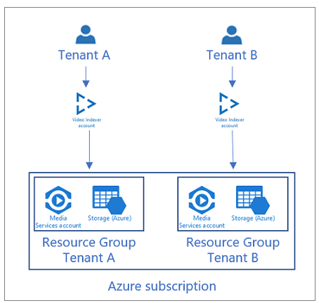
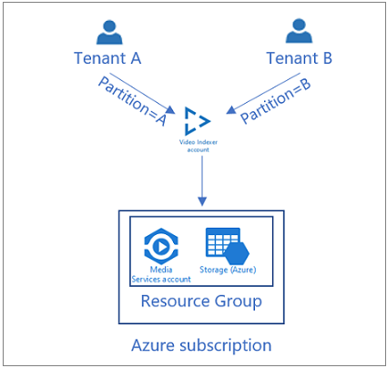
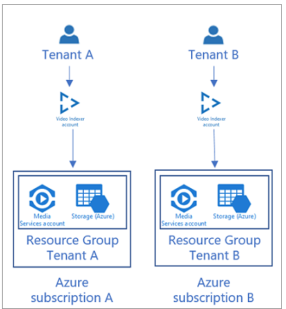

# Manage multiple tenants

This article discusses different options for managing multiple tenants with Azure AI Video Indexer. Choose a method that is most suitable for your scenario:

* Azure AI Video Indexer account per tenant
* Single Azure AI Video Indexer account for all tenants
* Azure subscription per tenant

## Azure AI Video Indexer account per tenant

An Azure AI Video Indexer account is created for each tenant. The tenants have full isolation in the persistent and compute layer.  

### Considerations

* Customers don't share storage accounts (unless manually configured by the customer).
* Customers don't share compute (reserved units) and don't affect processing jobs times of one another.
* You can easily remove a tenant from the system by deleting the Azure AI Video Indexer account.
* There's no ability to share custom models between tenants.

    Make sure there's no business requirement to share custom models.
* Harder to manage due to multiple Azure AI Video Indexer accounts per tenant.

> [!TIP]
> Create an admin user for your system in [the Azure AI Video Indexer developer portal](https://api-portal.videoindexer.ai/) and use the Authorization API to provide your tenants the relevant [account access token](https://api-portal.videoindexer.ai/api-details#api=Operations&operation=Get-Account-Access-Token).

## Single Azure AI Video Indexer account for all users

The customer is responsible for tenants isolation when using a single VI account for all users. All tenants have to use a single Azure AI Video Indexer account. The customer needs to filter the proper results for that tenant when uploading, searching, or deleting content, .

With this option, customization models (Person, Language, and Brands) can be shared or isolated between tenants by filtering the models by tenant.

When [uploading videos](https://api-portal.videoindexer.ai/api-details#api=Operations&operation=Upload-Video), you can specify a different partition attribute per tenant which allows isolation in the [search API](https://api-portal.videoindexer.ai/api-details#api=Operations&operation=Search-Videos). By specifying the partition attribute in the search API, you only get results of the specified partition. 

### Considerations

* Ability to share content and customization models between tenants.
* One tenant impacts the performance of other tenants.
* Customer needs to build a complex management layer on top of Azure AI Video Indexer.

> [!TIP]
> You can use the priority attribute to prioritize tenants jobs.

## Azure subscription per tenant 

Each tenant has their own Azure subscription when using an Azure subscription per tenant. For each user, you create a new Azure AI Video Indexer account in the tenant subscription.

### Considerations

* This configuration is the only option that enables billing separation.
* This integration has more management overhead than Azure AI Video Indexer account per tenant. If billing isn't a requirement, it's recommended to use one of the other options described in this article.
