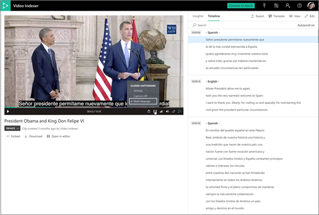

# Automatically identify and transcribe multi-language content

[!INCLUDE [AMS VI retirement announcement](./includes/important-ams-retirement-abbreviated.md)]

Azure AI Video Indexer supports automatic language identification and transcription in multi-language content. This process involves automatically identifying the spoken language in different segments from audio, sending each segment of the media file to be transcribed and combine the transcription back to one unified transcription. 

## Choosing multilingual identification on indexing with portal

You can choose **multi-language detection** when uploading and indexing your video. Alternatively, you can choose **multi-language detection**  when reindexing your video. The following steps describe how to reindex:

1. Browse to the [Azure AI Video Indexer](https://vi.microsoft.com/) website and sign in.
1. Go to the **Library** page and hover over the name of the video that you want to reindex. 
1. On the right-bottom corner, select the **Re-index video** button. 
1. In the **Re-index video** dialog, choose **multi-language detection** from the **Video source language** drop-down box.

    * When a video is indexed as multi-language the user to view which segment is transcribed in which language.
    * Translation to all languages is fully available from the multi-language transcript.
    * All other insights appear in the language that detected the most in the audio.
    * Closed captioning on the player is available in multi-language as well.



## Choosing multilingual identification on indexing with API

When indexing or [reindexing](https://api-portal.videoindexer.ai/api-details#api=Operations&operation=Re-Index-Video) a video using the API, choose the `multi-language detection` option in the `sourceLanguage` parameter.

### Model output

The model retrieves all of the languages detected in the video in one list

```json
"sourceLanguage": null,
"sourceLanguages": [
    "es-ES",
    "en-US"
],
```

Additionally, each instance in the transcription section includes the language in which it was transcribed

```json
{
  "id": 136,
  "text": "I remember well when my youth Minister took me to hear Doctor King I was a teenager.",
  "confidence": 0.9343,
  "speakerId": 1,
  "language": "en-US",
  "instances": [
    {
       "adjustedStart": "0:21:10.42",
       "adjustedEnd": "0:21:17.48",
       "start": "0:21:10.42",
       "end": "0:21:17.48"
    }
  ]
},
```

## Guidelines and limitations

* Audio that contains languages other than the ones you selected produces unexpected results.
* The minimal segment length for detecting each language is 15 seconds.
* The language detection offset is 3 seconds on average.
* Speech is expected to be continuous. Frequent alternations between languages might affect the model's performance.
* The speech of non-native speakers might affect the model's performance (for example, when speakers use their first language and they switch to another language).
* The model is designed to recognize spontaneous conversational speech with reasonable audio acoustics (not voice commands, singing, etc.).
* Project creation and editing are not available for multi-language videos.
* Custom language models aren't available when using multi-language detection.
* Adding keywords isn't supported.
* The language indication isn't included in the exported closed caption file.
* The update transcript in the API doesn't support multiple languages files.
