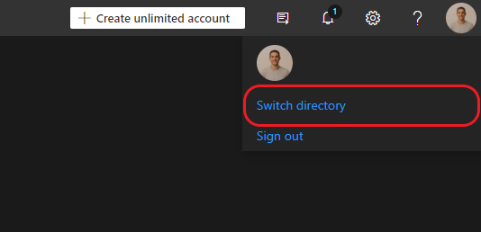
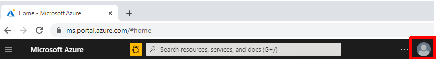

# Switch between multiple tenants

When working with multiple tenants/directories in the Azure environment user might need to switch between the different directories. 

When logging in the Azure AI Video Indexer website, a default directory will load and the relevant accounts and list them in the **Account list**.

> [!Note]
> Trial accounts are global and not tenant-specific. Hence, the tenant switching described in this article only applies to your ARM accounts.
>
> The option to switch directories is available only for users using Entra ID to log in. 

This article shows two options to solve the same problem - how to switch tenants:

- When starting [from within the Azure AI Video Indexer website](#switch-tenants-from-within-the-azure-ai-video-indexer-website).
- When starting [from outside of the Azure AI Video Indexer website](#switch-tenants-from-outside-the-azure-ai-video-indexer-website).

## Switch tenants from within the Azure AI Video Indexer website

1. To switch between directories in the [Azure AI Video Indexer](https://www.videoindexer.ai/), open the **User menu** > select **Switch directory**.

    > [!div class="mx-imgBorder"]
    > 

    Here user can view all detected directories listed. The current directory will be marked, once a different directory is selected the **Switch directory** button will be available.

    Once clicked, the authenticated credentials will be used to sign in again to the Azure AI Video Indexer website with the new directory.

## Switch tenants from outside the Azure AI Video Indexer website

This section shows how to get the domain name from the Azure portal. You can then sign in with it into th the [Azure AI Video Indexer](https://www.videoindexer.ai/) website.

### Get the domain name

1. Sign in to the [Azure portal](https://portal.azure.com) using the same subscription tenant in which your Azure AI Video Indexer Azure Resource Manager (ARM) account was created. 
1. Hover over your account name (in the right-top corner). 

    > [!div class="mx-imgBorder"]
    > 
1. Get the domain name of the current Azure subscription, you'll need it for the last step of the following section. 

If you want to see domains for all of your directories and switch between them, see [Switch and manage directories with the Azure portal](/azure/azure-portal/set-preferences#switch-and-manage-directories).

### Sign in with the correct domain name on the VI website

1. Go to the [Azure AI Video Indexer](https://www.videoindexer.ai/) website.
1. Select **Sign out** after pressing the button in the top-right corner.
1. On the VI website, press **Sign in** and choose the Entra ID account.
1. Select **Use another account**.
1. Choose **Sign-in with other options**.
1. Select **Sign in to an organization**.
1. Enter the domain name you copied in the [Get the domain name from the Azure portal](#get-the-domain-name) section.